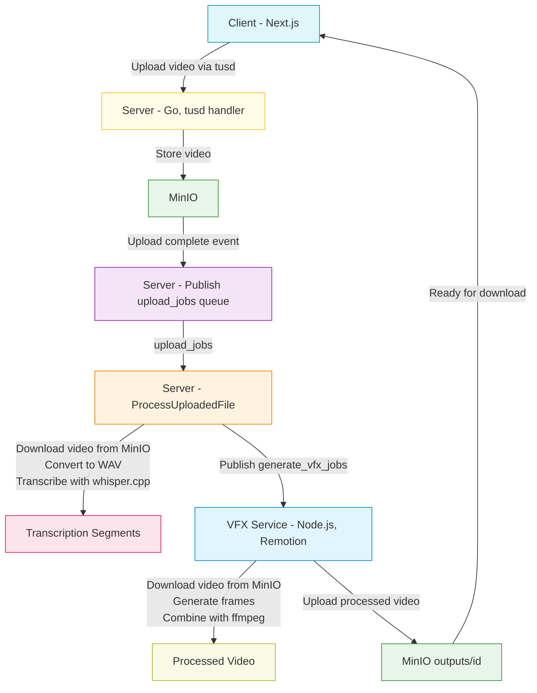

# Subvision

**Subvision** is an AI-powered subtitle generator. Upload your video, and Subvision will automatically generate subtitles using AI, track your process, and let you download the result when it's ready.

---

## Features

- Video upload with resumable uploads (tus protocol)
- Automatic subtitle generation using AI
- Track processing status
- Download processed videos with subtitles
- Modern web UI (Next.js, Tailwind CSS)
- Backend with Gin, MinIO, RabbitMQ, tusd

---

## Architecture

- **Client:** Next.js app ([client/](client))
- **Server:** Go backend ([server/](server))
- **Vfx:** Node.js service for subtitle rendering and effects using Remotion ([vfx/](vfx))
- **MinIO:** S3-compatible object storage for uploads
- **RabbitMQ:** Job queue for processing
- **tusd:** Resumable upload server

---

---

## System Architecture Diagram



---

## Reference

- **Speech-to-text** is powered by [whisper.cpp](https://github.com/ggerganov/whisper.cpp), a fast and portable implementation of OpenAI's Whisper model.

---

## Getting Started

### Prerequisites

- [Docker](https://docs.docker.com/get-docker/) & [Docker Compose](https://docs.docker.com/compose/)

### 1. Clone the repository

```sh
git clone --recurse-submodules https://github.com/yourusername/subvision.git
cd subvision
```

### 2. Configure environment variables

Copy the example environment files and edit them as needed:

```sh
cp server/.env.example server/.env
cp client/.env.example client/.env
cp vfx/.env.example vfx/.env
```

- Edit `server/.env` for backend configuration (see [server/.env.example](server/.env.example))
- Edit `client/.env` for frontend configuration (see [client/.env.example](client/.env.example))
- Edit `vfx/.env` for VFX service configuration (see [vfx/.env.example](vfx/.env.example))

### 3. Start all services

```sh
docker-compose up --build
```

### 4. Access the app

- **Frontend:** [http://localhost:3000](http://localhost:3000)
- **Backend API:** [http://localhost:8080](http://localhost:8080)
- **MinIO Console:** [http://localhost:9001](http://localhost:9001) (user: `minio`, pass: `minio123`)
- **RabbitMQ Console:** [http://localhost:15672](http://localhost:15672) (user: `guest`, pass: `guest`)

---

## Development

### Client

```sh
cd client
pnpm install
pnpm dev
```

### Server

```sh
cd server
go mod tidy
go run ./cmd/subvision/main.go
```

### Vfx

```sh
cd vfx
pnpm install
pnpm dev
```

---

## Folder Structure

```
/client   # Next.js frontend
/server   # Go backend
/vfx      # Node.js Remotion-based subtitle/effects renderer
```

---

## Environment Variables

### Server (`server/.env.example`)

```env
PORT=8000
TMP_DIR=/tmp

CLIENT_URL=http://localhost:3000

MINIO_HOST=minio
MINIO_PORT=9000
MINIO_ACCESS_KEY=minio
MINIO_SECRET_KEY=minio123
MINIO_BUCKET=subvision

RABBITMQ_HOST=rabbitmq
RABBITMQ_PORT=5672
RABBITMQ_USER=guest
RABBITMQ_PASSWORD=guest

# Default to third_party/whisper.cpp/bindings/go/models/*.bin
WHISPER_MODEL_PATH=third_party/whisper.cpp/bindings/go/models/ggml-base.en.bin
```

### Client (`client/.env.example`)

```env
NEXT_PUBLIC_SERVER_URL=http://localhost:8000
```

### Vfx

```env
TMP_DIR=tmp

MINIO_HOST=minio
MINIO_PORT=9000
MINIO_ACCESS_KEY=minio
MINIO_SECRET_KEY=minio123
MINIO_BUCKET=subvision

RABBITMQ_HOST=rabbitmq
RABBITMQ_PORT=5672
RABBITMQ_USER=guest
RABBITMQ_PASSWORD=guest
```

---

## TODO

1. Integrate with Remotion for advanced video rendering.
2. Add parameter requests from client for user subtitle preferences:

- Language
- Color
- Outline
- Border
- Font name
- Font size
- Vertical margin (vmargin)

3. Add functionality to split subtitle segments by max characters or by seconds.
4. Add configuration for users to resize the video.

---

## License

MIT

---

**Made with ❤️ for creators.**
