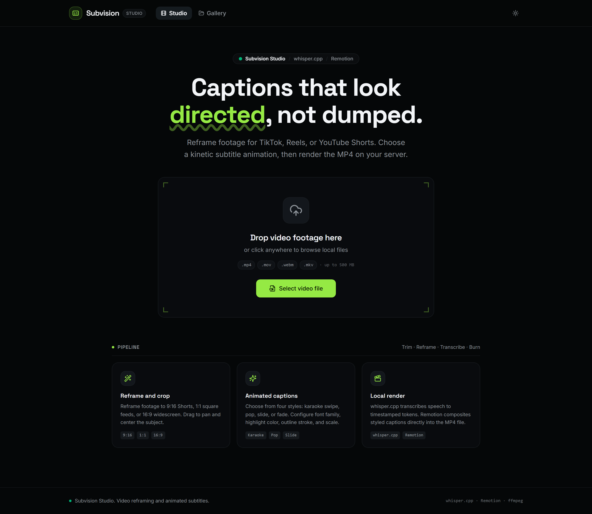
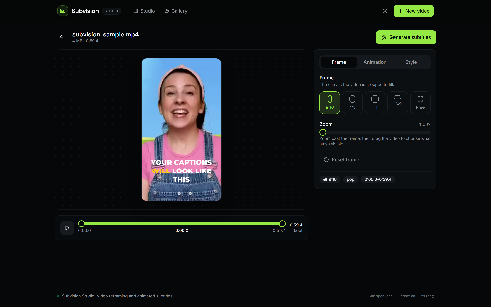
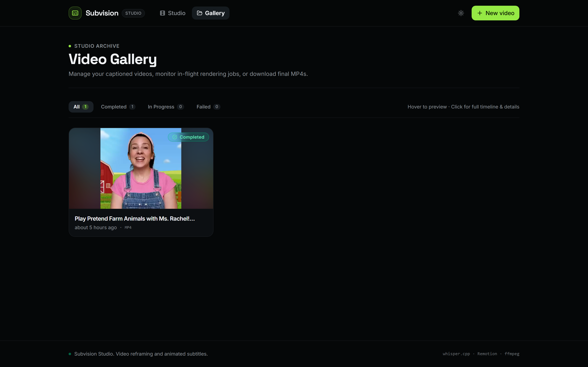
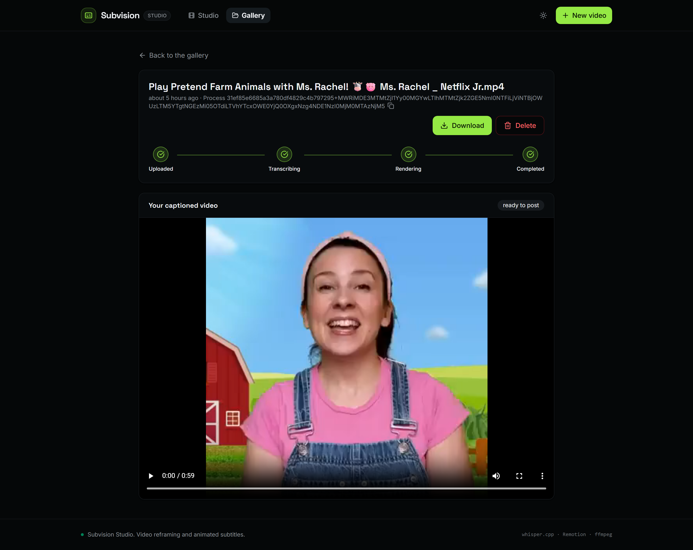
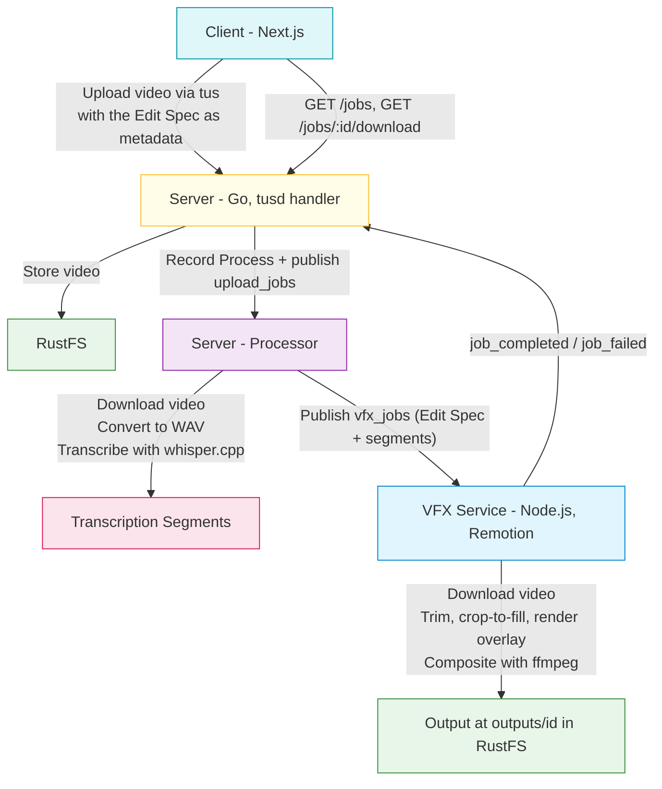

# Subvision

Subvision transcribes the audio of uploaded videos with whisper.cpp and burns
styled subtitles onto them with Remotion and ffmpeg. A browser editor trims
and reframes the video and styles the captions; the edit travels with the
upload as metadata and is applied server-side in a single render pass.

## Screenshots









---

## Features

- **Editor**: Trim video duration, reframe to 9:16, 4:5, 1:1, 16:9, or free drag, and pan/zoom the crop with live canvas preview.
- **Caption styling**: Configure font family, scale, text color, outline stroke, vertical position, background plate, uppercase mode, and highlight color.
- **Caption animations**: Pick from fade, slide, karaoke swipe, or word-by-word pop, chosen manually or resolved randomly on submit.
- **Resumable uploads**: Transfers videos over tus, attaching the edit spec directly as upload metadata (ADR-0003).
- **Local transcription**: whisper.cpp extracts timestamped speech segments with per-word timings on the server.
- **VFX compositor**: Remotion and ffmpeg composite the styled captions onto the trimmed footage.
- **Gallery**: Monitor in-flight jobs, preview finished videos on hover, and download rendered MP4 files.
- **Stack**: Next.js client with Tailwind CSS v4 and shadcn/ui; Go backend with Gin, tusd, RabbitMQ, and RustFS; Node.js VFX service with Remotion.

---

## Architecture

- **Client:** Next.js app ([client/](client))
- **Server:** Go backend ([server/](server))
- **Vfx:** Node.js service that renders the subtitle overlay with Remotion and composites it onto the video with ffmpeg ([vfx/](vfx))
- **RustFS:** S3-compatible object storage for uploads and outputs
- **RabbitMQ:** Job queue for processing
- **tusd:** Resumable upload server

---

## System Architecture Diagram


```mermaid
flowchart TD
    A[Client - Next.js] -- Upload video via tus<br>with the Edit Spec as metadata --> B[Server - Go, tusd handler]
    B -- Store video --> C[RustFS]
    B -- Record Process + publish upload_jobs --> D[Server - Processor]
    D -- Download video<br>Convert to WAV<br>Transcribe with whisper.cpp --> F[Transcription Segments]
    D -- Publish vfx_jobs (Edit Spec + segments) --> G[VFX Service - Node.js, Remotion]
    G -- Download video<br>Trim, crop-to-fill, render overlay<br>Composite with ffmpeg --> H[Output at outputs/id in RustFS]
    G -- job_completed / job_failed --> B
    A -- GET /jobs, GET /jobs/:id/download --> B

    style A fill:#e0f7fa,stroke:#0097a7
    style B fill:#fffde7,stroke:#fbc02d
    style C fill:#e8f5e9,stroke:#388e3c
    style D fill:#f3e5f5,stroke:#8e24aa
    style F fill:#fce4ec,stroke:#d81b60
    style G fill:#e1f5fe,stroke:#0288d1
    style H fill:#e8f5e9,stroke:#388e3c
```

---

## Reference

Subvision uses [whisper.cpp](https://github.com/ggerganov/whisper.cpp) for speech-to-text transcription.

---

## Getting Started

### Prerequisites

- [Docker](https://docs.docker.com/get-docker/) & [Docker Compose](https://docs.docker.com/compose/)

### 1. Clone the repository

```sh
git clone --recurse-submodules https://github.com/rubichandrap/subvision.git
cd subvision
```

### 2. Configure environment variables

Copy the example environment files and edit them as needed:

```sh
cp server/.env.example server/.env
cp client/.env.example client/.env
cp vfx/.env.example vfx/.env
```

- Edit `server/.env` for backend configuration (see [server/.env.example](server/.env.example))
- Edit `client/.env` for frontend configuration (see [client/.env.example](client/.env.example))
- Edit `vfx/.env` for VFX service configuration (see [vfx/.env.example](vfx/.env.example))

### 3. Start all services

```sh
docker-compose up --build
```

### 4. Access the app

- **Frontend:** [http://localhost:3000](http://localhost:3000)
- **Backend API:** [http://localhost:8080](http://localhost:8080)
- **RustFS Console:** [http://localhost:9001](http://localhost:9001) (user: `rustfs`, pass: `rustfs123`)
- **RabbitMQ Console:** [http://localhost:15672](http://localhost:15672) (user: `guest`, pass: `guest`)

---

## Development

### Client

```sh
cd client
pnpm install
pnpm dev
```

### Server

```sh
cd server
go mod tidy
go run ./cmd/subvision/main.go
```

### Vfx

```sh
cd vfx
pnpm install
pnpm dev
```

---

## Folder Structure

```
/client   # Next.js frontend
/server   # Go backend
/vfx      # Node.js Remotion-based subtitle/effects renderer
```

---

## Environment Variables

One contract for the whole stack. Values are documented here and mirrored in matching
`.env.example` files. **Bold** variables are required: each service loader fails at boot
when one is missing and names the variable. Everything else has a documented default.
No variable falls back to silent credentials or default URLs.
| Variable | Service(s) | Required | Default | Description |
| --- | --- | :---: | --- | --- |
| `PORT` | server | **yes** | — | Port the Gin server listens on. |
| `TMP_DIR` | server, vfx | **yes** | — | Scratch directory for videos, audio, frames, rendered outputs. |
| `CLIENT_URL` | server | **yes** | — | Origin of the Next.js client, allowed by the server's CORS. |
| `WHISPER_MODEL_PATH` | server | **yes** | — | Path to the whisper.cpp ggml model. |
| `S3_ENDPOINT` | server, vfx | **yes** | — | Full URL of the S3-compatible store (RustFS in compose). |
| `S3_ACCESS_KEY` | server, vfx | **yes** | — | S3 access key. |
| `S3_SECRET_KEY` | server, vfx | **yes** | — | S3 secret key. |
| `S3_BUCKET` | server, vfx | **yes** | — | One shared bucket for `uploads/` and `outputs/`. |
| `RABBITMQ_HOST` | server, vfx | **yes** | — | RabbitMQ host. |
| `RABBITMQ_PORT` | server, vfx | **yes** | — | RabbitMQ AMQP port. |
| `RABBITMQ_USER` | server, vfx | **yes** | — | RabbitMQ user. |
| `RABBITMQ_PASSWORD` | server, vfx | **yes** | — | RabbitMQ password. |
| `RABBITMQ_PREFETCH` | vfx | no | `1` | How many VFX Jobs the consumer processes concurrently. |
| `RABBITMQ_MAX_ATTEMPTS` | vfx | no | `3` | Attempts before a failing VFX Job dead-letters. |
| `RENDER_FPS` | vfx | no | `30` | Frame rate used for rendering. |
| `RENDER_WIDTH` | vfx | no | `1920` | Render width in pixels. |
| `RENDER_HEIGHT` | vfx | no | `1080` | Render height in pixels. |
| `RENDER_TEMPLATE` | vfx | no | `karaoke` | Fallback subtitle template for jobs without an Edit Spec (`fade`, `slide`, `karaoke`, `pop`). |
| `NEXT_PUBLIC_SERVER_URL` | client | **yes** | — | Base URL the browser uses to reach the server (status API + tus uploads). |

### Example files

```env
# server/.env
PORT=8080
TMP_DIR=/tmp
CLIENT_URL=http://localhost:3000
WHISPER_MODEL_PATH=third_party/whisper.cpp/bindings/go/models/ggml-base.en.bin
S3_ENDPOINT=http://rustfs:9000
S3_ACCESS_KEY=rustfs
S3_SECRET_KEY=rustfs123
S3_BUCKET=subvision
RABBITMQ_HOST=rabbitmq
RABBITMQ_PORT=5672
RABBITMQ_USER=guest
RABBITMQ_PASSWORD=guest
```

```env
# vfx/.env
TMP_DIR=tmp
S3_ENDPOINT=http://rustfs:9000
S3_ACCESS_KEY=rustfs
S3_SECRET_KEY=rustfs123
S3_BUCKET=subvision
RABBITMQ_HOST=rabbitmq
RABBITMQ_PORT=5672
RABBITMQ_USER=guest
RABBITMQ_PASSWORD=guest
RABBITMQ_PREFETCH=1
RABBITMQ_MAX_ATTEMPTS=3
RENDER_FPS=30
RENDER_WIDTH=1920
RENDER_HEIGHT=1080
RENDER_TEMPLATE=karaoke
```

```env
# client/.env
NEXT_PUBLIC_SERVER_URL=http://localhost:8080
```

The compose stack also sets `RUSTFS_ACCESS_KEY`, `RUSTFS_SECRET_KEY`,
`RUSTFS_ADDRESS`, and `RUSTFS_CONSOLE_*` on the RustFS container itself, and sets
the bucket access policy in the `createbuckets` sidecar. Those configure the
storage adapter rather than the application services, and match the values above.

---

## TODO

1. Language selection and translation for subtitles.
2. Saved caption style presets in the editor.
3. Frame thumbnails on the trim timeline.

---

## Support

If this project helps you, consider [buying me a coffee](https://buymeacoffee.com/rubichandrap).

---

## License

MIT

